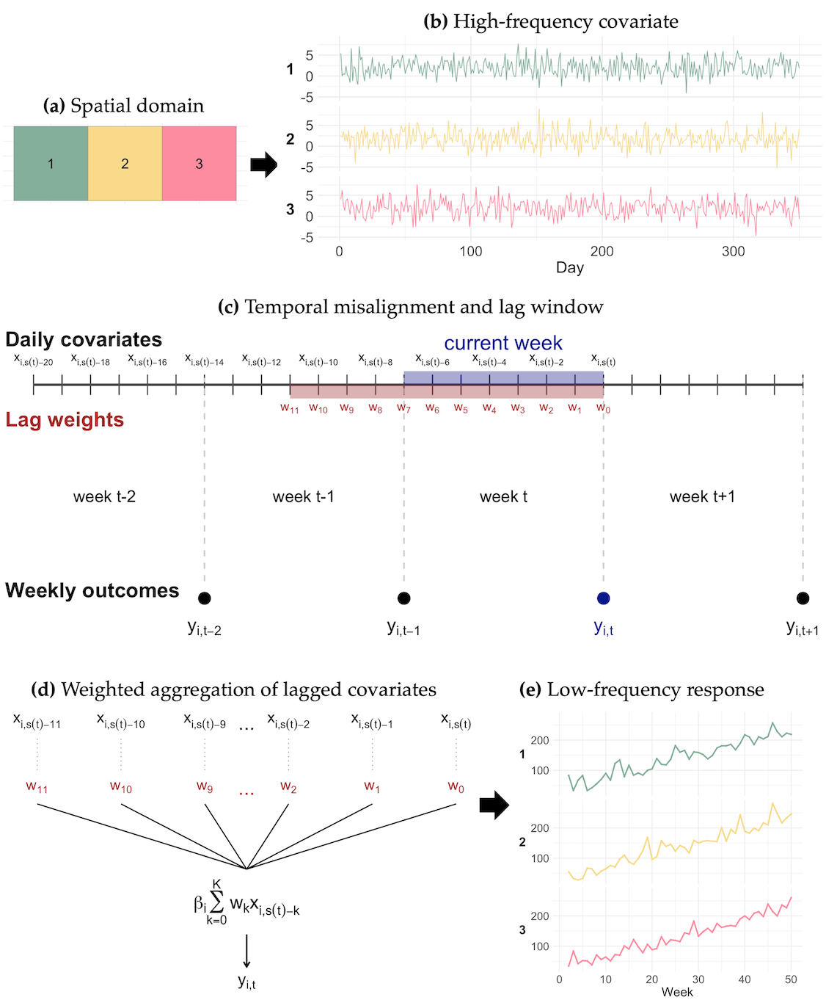

<!-- badges: start -->

<!-- badges: end -->

`midasINLA` provides tools for fitting mixed-data sampling (MIDAS) regression models using Integrated Nested Laplace Approximation (INLA). The package is designed for settings where the response is observed at a lower frequency than one or more explanatory variables, and supports both constant and spatially varying regression coefficients.

## Overview

MIDAS models allow high-frequency covariates to be incorporated into models for lower-frequency responses through weighted distributed lags. `midasINLA` combines this framework with INLA, allowing MIDAS regression models to be fitted efficiently within a latent Gaussian modelling framework.

The conceptual framework for spatial distributed-lag MIDAS modelling is illustrated in the figure below. High-frequency covariates are linked to lower-frequency responses through weighted distributed lags, with MIDAS coefficients potentially varying across spatial locations. This is illustrated in the figure below:

```{r schematic, echo=FALSE, out.width="70%", fig.align="center", fig.cap = "Figure 1. Schematic representation of the spatial mixed-frequency setting and the MIDAS aggregation mechanism. (a) Spatial domain with three areal units. (b) Daily high-frequency covariate processes for each unit. (c) Temporal misalignment between daily covariates and weekly outcomes, with the highlighted lag window corresponding to the covariates used to predict the current weekly response. (d) MIDAS-based weighted aggregation of lagged daily covariates into a low-frequency predictor. (e) Weekly low-frequency response process for each spatial unit."}

```


