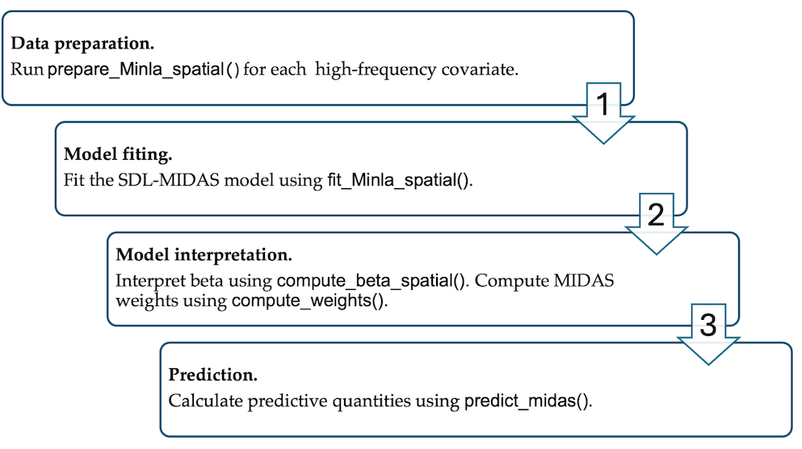
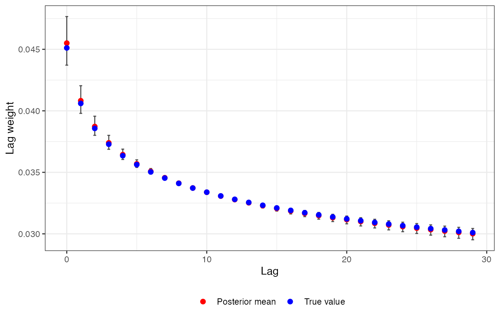
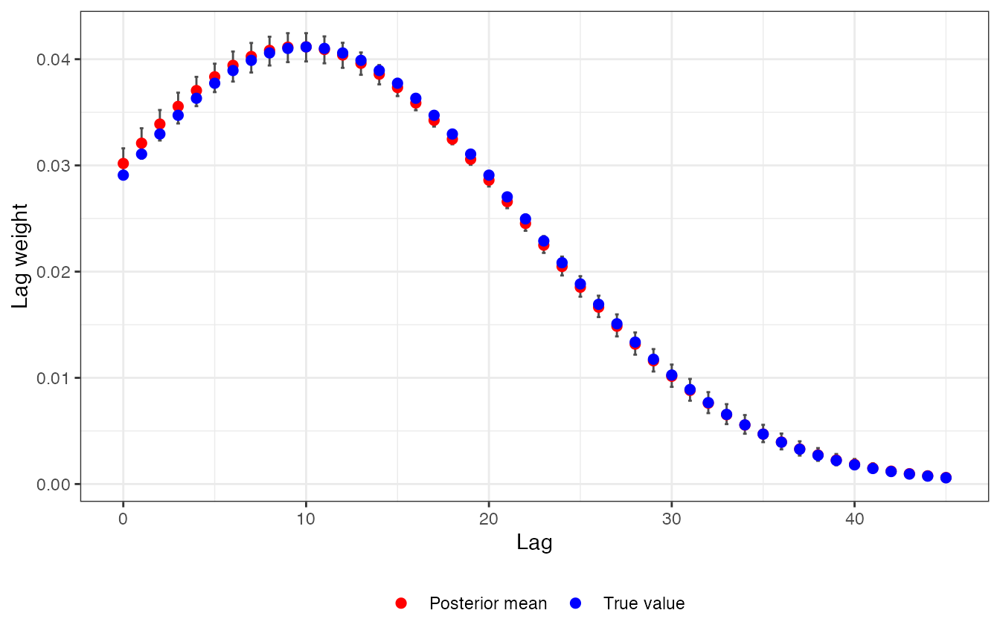
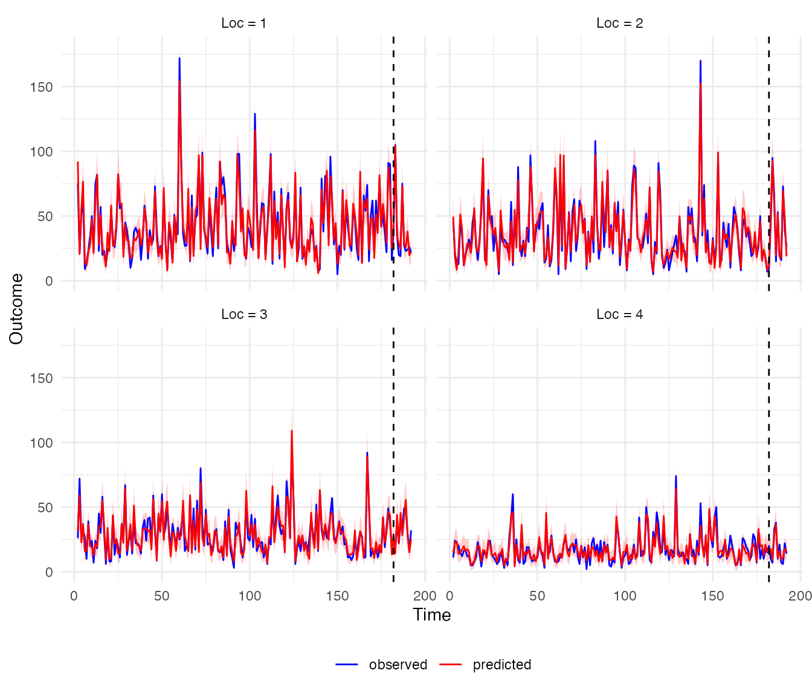

# Getting started with midasINLA

## Introduction

`midasINLA` provides tools for fitting mixed-frequency time-series
models using the Integrated Nested Laplace Approximation (INLA)
framework, with support for both constant and spatially varying
regression coefficients.

The package allows high-frequency covariates to be incorporated into a
lower-frequency response model through MIDAS lag-weight functions.
Different constraint schemes can be used to model the lag weights, while
coefficients can be either constant or spatially varying.

## Model

Consider a response variable $`y_{it}`$, indexed by spatial unit
$`i=1,\ldots,N`$ and low-frequency time point $`t=1,\ldots,T`$. The
predictor $`x_{i\tau}`$ is observed at a higher frequency. The MIDAS
framework relates the low-frequency response to multiple high-frequency
observations through a weighted distributed lag:

``` math
\begin{aligned}
        &y_{it} \sim F, \;\;\; \mathbb{E}(y_{it}) = \mu_{it} \\
        &g(\mu_{it}) = \beta_0 + \beta_i\sum_{k=0}^K w_kx_{i,s(t)-k} + \epsilon_{it} \\
        &w_k=h(\boldsymbol{\gamma},k) \; \text{and} \; \sum_{k=0}^K w_k=1.
\end{aligned}
```

Here, $`g(\cdot)`$ is the link function, $`\beta_0`$ is the intercept,
and $`\beta_i`$ is the regression coefficient for the high-frequency
predictor for the $`i^{\text{th}}`$ spatial unit. The function
$`h(\boldsymbol{\gamma},k)`$ determines the MIDAS lag weights, where
$`\boldsymbol{\gamma}\in\mathbb{R}^d`$ contains the parameters governing
the shape of the weighting function. The weights are constrained to sum
to one, which separates the overall magnitude of the predictor effect,
represented by $`\beta_i`$, from the relative contributions of the
individual lags.

The index $`s(t)`$ denotes the cumulative number of high-frequency
observations up to low-frequency time point t,

``` math
s(t)=\sum_{j=1}^{t}m_j,
```

where $`m_t`$ is the number of high-frequency observations associated
with the $`t^{\text{th}}`$ low-frequency observation. In the examples
below, the same high-frequency sampling structure is assumed across
spatial units.

The main flexibility of the model comes from the choice of the
lag-weight function $`h(\boldsymbol{\gamma},k)`$. midasINLA provides
functions for constructing different MIDAS weighting schemes and
incorporating them into an INLA model, while allowing the regression
coefficient to be either constant or spatially varying.

### Spatially varying coefficients

midasINLA allows the regression coefficient $`\beta_i`$ to vary across
spatial units in two ways:

- Spatially structured coefficient:
  ``` math
    \beta_i = \beta^* + b_i, \qquad
    \boldsymbol{b} \sim \operatorname{iCAR}(\tau_b,\mathbf{W}),
    
  ```
  where $`\beta^*`$ is the overall effect and $`b_i`$ represents the
  spatially structured deviation for unit $`i`$. The deviations follow
  an intrinsic conditional autoregressive (iCAR) model with precision
  $`\tau_b`$ and spatial weights matrix $`\mathbf{W}`$, subject to the
  sum-to-zero constraint $`\sum_i b_i=0`$.
- Unstructured coefficient:
  ``` math
    \beta_i \overset{iid}{\sim}
    N(0,\sigma_\beta^2),
    
  ```
  where the coefficients are independent across spatial units.

A constant coefficient, $`\beta_i\equiv\beta`$, is also supported and
corresponds to the special case in which the effect is the same across
all spatial units.

### Constraint functions

The lag weights are obtained by normalising a constraint function
$`\psi(\boldsymbol{\gamma},k)`$:

``` math
w_k = h(\boldsymbol{\gamma},k)
= \frac{\psi(\boldsymbol{\gamma},k)}
{\sum_{j=0}^K \psi(\boldsymbol{\gamma},j)}.
```

midasINLA implements several commonly used constraint functions.

1.  Exponential Almon polynomial (order 2):

``` math
\psi(\boldsymbol{\gamma},k) = \exp\left(\sum_{j=1}^{2}\gamma_j k^j\right),
```

where $`\boldsymbol{\gamma}=(\gamma_1,\gamma_2)`$.

2.  Beta polynomial:

``` math
\psi(\boldsymbol{\gamma},k) = x_k^{\gamma_1-1}(1-x_k)^{\gamma_2-1},
```

where

``` math
x_k=\xi+(1-2\xi)\frac{k}{K},
```

with $`\xi>0`$ a small fixed constant and
$`\boldsymbol{\gamma}=(\gamma_1,\gamma_2)`$. A one-parameter version is
obtained by fixing $`\gamma_1=1`$.

3.  Hyperbolic scheme:

``` math
\psi(\gamma,k) = \frac{\Gamma(k+\gamma)}{\Gamma(k+1)\Gamma(\gamma)},
```
where $`\gamma>0`$.

4.  Gaussian kernel:

``` math
\psi(\boldsymbol{\gamma},k)=\exp\left\{-\frac{(k-\gamma_1)^2}{2\gamma_2}\right\}.
```

where $`\boldsymbol{\gamma}=(\gamma_1,\gamma_2)`$ and $`\gamma_2>0`$.

The shape of the lag-weight distribution depends on the constraint
function and its parameters. The following figures illustrate
representative weight profiles for the constraint functions implemented
in `midasINLA`.


Illustration of the MIDAS lag weights for exponential Almon polynomial
constraint of order 2.


Illustration of the MIDAS lag weights for hyperbolic scheme polynomial
constraint.

## Implementation

The MIDAS lag structure is incorporated into the latent Gaussian model
through INLA’s `rgeneric` interface. The MIDAS constraint functions
define the lag weights as a function of a low-dimensional parameter
vector, while the resulting weighted high-frequency covariates are
represented as part of the latent field.

The functions in `midasINLA` construct the required `rgeneric` model
components and interface them with
[`INLA::inla()`](https://rdrr.io/pkg/INLA/man/inla.html). This allows
the MIDAS lag-weight parameters and regression coefficients to be
estimated within the INLA framework, while retaining the spatial
structure specified for the regression coefficients.

Users do not need to construct the `rgeneric` model directly; this is
handled internally by the package functions.

The general workflow for fitting and analysing an SDL-MIDAS model using
`midasINLA` is shown below:



General workflow.

The main functions are:

- `prepare_Minla_spatial`() prepares high-frequency covariates for
  inclusion in the model;
- `fit_Minla_spatial`() fits the resulting model using INLA;
- `compute_beta_spatial`() obtains posterior summaries of the regression
  coefficients;
- `compute_weights`() obtains posterior summaries of the MIDAS lag
  weights;
- `predict_midas`() generates posterior predictions.

## Load packages

``` r

library(midasINLA)
library(INLA)
library(ggplot2)
library(dplyr)
library(tidyr)
```

## Simulated spatial Poisson example

We consider an outcome $`y_{it}`$ observed at 16 spatial locations and
192 time points. Two high-frequency covariates, $`x_{1it}`$ and
$`x_{2it}`$, are available for each location. There are 30
high-frequency observations corresponding to each response time point.

The first covariate uses a hyperbolic lag-weight constraint with
$`\gamma = 0.9`$ and 29 lags. Its regression coefficient varies
spatially according to an intrinsic conditional autoregressive (iCAR)
model.

The second covariate uses a Gaussian lag-weight constraint with
$`\gamma_1 = 10`$ and $`\sqrt{\gamma_2} = 12`$ and 45 lags. Its
regression coefficient is constant across locations.

The data were generated using a Poisson model of the form

``` math
y_{it} \sim \operatorname{Poisson}(\mu_{it}),
```
with

``` math
\log(\mu_{it}) =
\beta_0 +
(\beta_1^* + b_i)
\sum_{k=0}^{29} w_{1k}x_{1i,s(t)-k}
+
\beta_2
\sum_{k=0}^{45} w_{2k}x_{2i,s(t)-k},
```

where $`\boldsymbol{b}`$ follows an iCAR model. The true values of the
parameters are $`\beta_0 = 1`$, $`\beta_1^* = 1.1`$, and
$`\beta_2 = -2`$.

The simulated data are included with the package and can be loaded
using:

``` r

data("data_spatialpoisson_example")
```

The dataset is provided as a list containing the response, two
high-frequency covariates, the spatial polygons, and the true parameter
values used to generate the data. The available components can be
inspected with:

``` r

names(data_spatialpoisson_example)
#>  [1] "data_x1"  "data_x2"  "data_y"   "weights1" "weights2" "eta"     
#>  [7] "beta0"    "beta1"    "beta2"    "icar"     "tau"      "grid_sf"
```

The response data are stored in data_y and contain the outcome together
with the spatial and temporal indices:

``` r

head(data_spatialpoisson_example[["data_y"]])
#>    y loc Time
#> 1 NA   1    1
#> 2 75   1    2
#> 3 21   1    3
#> 4 51   1    4
#> 5 63   1    5
#> 6  9   1    6
```

The high-frequency covariates are stored in `data_x1` and `data_x2`.
Each contains the covariate values together with their corresponding
spatial indices:

``` r

head(data_spatialpoisson_example$data_x1)
#>           x1 loc Time
#> 1 5.42730258   1    1
#> 2 0.02233117   1    2
#> 3 0.56899585   1    3
#> 4 0.36948942   1    4
#> 5 2.36128703   1    5
#> 6 0.19844343   1    6
head(data_spatialpoisson_example$data_x2)
#>           x2 loc Time
#> 1 -0.8913253   1    1
#> 2  0.8279532   1    2
#> 3  1.7493964   1    3
#> 4  0.1564567   1    4
#> 5 -1.3907526   1    5
#> 6 -0.1627427   1    6
```

The neighbourhood structure used to generate the spatially varying
coefficient is stored as an `inla.graph` object. It can be loaded from
the package using:

``` r

g <- INLA::inla.read.graph(
  filename = system.file("map.adj", package = "midasINLA")
)
```

## Preparing the MIDAS covariates

Before fitting the model, each high-frequency covariate is prepared
using `prepare_Minla_spatial`().

For the first covariate, we use the hyperbolic constraint and allow the
coefficient to vary spatially according to an iCAR model:

``` r

Midas_x1 <- prepare_Minla_spatial(
  x = data_spatialpoisson_example$data_x1$x1,
  loc_x = data_spatialpoisson_example$data_x1$loc,
  constraint = "hyperbolic",
  K = 0:29,
  m = 30,
  svc = TRUE,
  svc_prior = "icar",
  g = g
)
```

``` r

Midas_x2 <- prepare_Minla_spatial(
  x = data_spatialpoisson_example$data_x2$x2,
  loc_x = data_spatialpoisson_example$data_x2$loc,
  constraint = "gaussian",
  K = 0:45,
  m = 30,
  svc = FALSE
)
```

The resulting objects contain the information required by
`fit_Minla_spatial`() to construct the MIDAS components of the model.

## Fitting the model

The response data are stored in data_y. To illustrate prediction, we
reserve the final 10 response time points at each location as a test
set.

``` r

response_data <- data_spatialpoisson_example[["data_y"]]

response_data$y_all <- response_data$y

response_data[which(response_data[["Time"]] %in% 183:192),"y"] <- NA
```

The model can then be fitted using `fit_Minla_spatial`():

``` r

fit_res <- fit_Minla_spatial(
  formula = y ~ 1,
  data = response_data,
  loc_var = "loc",
  time_var = "Time",
  family = "poisson",
  hf_input = list(Midas_x1, Midas_x2),
  inla_options = list(
    verbose = FALSE,
    control.predictor = list(
      compute = TRUE,
      link = 1
    )
  )
)
```

A summary of the fitted model can be obtained using the standard
`summary`() method:

``` r

summary(fit_res[["res"]])
```

The fitted model contains two MIDAS components, corresponding to the two
high-frequency covariates. The model also estimates the spatially
varying coefficient associated with the first covariate. The parameters
governing the MIDAS lag-weight functions are reported with names
beginning with `hf_idx_`.

## Posterior summaries of regression coefficients

Posterior summaries of the MIDAS regression coefficients can be obtained
using
[`compute_beta_spatial()`](https://stephen-villejo.github.io/midasINLA/reference/compute_beta_spatial.md).

``` r

beta_results <- compute_beta_spatial(
  model = fit_res,
  n_loc = 16
)
```

The returned object contains results for each high-frequency covariate,
including marginal distributions and posterior summaries.

For the first covariate, the posterior summaries of the spatially
varying component $`b_i`$ can be accessed using:

``` r

beta_results$hf_index_1$summary.icar.beta
#>             Mean          SD         2.5%          50%       97.5%
#> b1   0.144625920 0.005026816  0.134579060  0.144553591  0.15434246
#> b2   0.136794201 0.005505744  0.125760927  0.137143194  0.14699417
#> b3   0.006091131 0.006039512 -0.005751688  0.006139525  0.01770044
#> b4  -0.223847710 0.007987181 -0.239855867 -0.223815892 -0.20750554
#> b5   0.137506207 0.005106865  0.127447858  0.137394699  0.14741294
#> b6   0.034293344 0.006037629  0.022064552  0.034654270  0.04623597
#> b7  -0.105033783 0.006542477 -0.118385444 -0.104944088 -0.09242093
#> b8   0.040220869 0.005921632  0.028546229  0.040366688  0.05239544
#> b9   0.124911910 0.005699686  0.113110204  0.124951457  0.13569821
#> b10  0.019733878 0.005964274  0.008134466  0.019734037  0.03136015
#> b11 -0.059292125 0.006897550 -0.072349123 -0.059145697 -0.04516908
#> b12 -0.170429731 0.007208214 -0.184599911 -0.170469520 -0.15620031
#> b13 -0.141316295 0.006822085 -0.154432690 -0.141202644 -0.12762342
#> b14 -0.132093150 0.007637109 -0.146832232 -0.132112566 -0.11719708
#> b15 -0.059319213 0.006492554 -0.072543068 -0.059513117 -0.04765402
#> b16  0.245836663 0.004890699  0.236812281  0.245597376  0.25593473
```

The spatially varying coefficient at location $`i`$ is defined as

``` math
  \beta_{1,i} = \beta_1^* + b_i.
```
Posterior summaries of the resulting total coefficient can be accessed
using:

``` r

beta_results$hf_index_1$summary.total.beta
#>             Mean          SD      2.5%       50%     97.5%
#> beta1  1.2456021 0.010206852 1.2248130 1.2456309 1.2654170
#> beta2  1.2380379 0.010937939 1.2161629 1.2384118 1.2589107
#> beta3  1.1075697 0.010952689 1.0856856 1.1079096 1.1286052
#> beta4  0.8773060 0.012509122 0.8532530 0.8775585 0.9014133
#> beta5  1.2390943 0.010069789 1.2187041 1.2393857 1.2588751
#> beta6  1.1353571 0.011006713 1.1138469 1.1351059 1.1568110
#> beta7  0.9965000 0.011102188 0.9741508 0.9962822 1.0176284
#> beta8  1.1413866 0.011093272 1.1190176 1.1410405 1.1624239
#> beta9  1.2264599 0.010263133 1.2071591 1.2263916 1.2458617
#> beta10 1.1210629 0.011494726 1.0979652 1.1211602 1.1443605
#> beta11 1.0419675 0.011707781 1.0185426 1.0416246 1.0647914
#> beta12 0.9307606 0.011492386 0.9088384 0.9305709 0.9530905
#> beta13 0.9600410 0.012184315 0.9349483 0.9602267 0.9841566
#> beta14 0.9694238 0.012141093 0.9464963 0.9692259 0.9945197
#> beta15 1.0416403 0.011158586 1.0189448 1.0415195 1.0640708
#> beta16 1.3472807 0.009909245 1.3278745 1.3473052 1.3664379
```

For the second covariate, which has a constant regression coefficient,
posterior summaries of $`\beta_2`$ are available using:

``` r

beta_results$hf_index_2$summary.beta
#>           Mean         SD      2.5%       50%     97.5%
#> beta -1.991549 0.02305254 -2.036627 -1.991615 -1.946129
```

## Estimating the MIDAS lag weights

The posterior distributions of the lag weights can be obtained using
[`compute_weights()`](https://stephen-villejo.github.io/midasINLA/reference/compute_weights.md):

``` r

res_weights <- compute_weights(fit_res)
```

The result is a list containing one data frame for each high-frequency
covariate. Each data frame contains the lag, posterior mean, and lower
and upper posterior quantiles.

For example, the estimated weights for the first covariate are:

``` r

head(res_weights$hf_1)
#>   lag       mean       q2.5      q97.5
#> 1   0 0.04550320 0.04371408 0.04766043
#> 2   1 0.04082168 0.03979364 0.04204024
#> 3   2 0.03872292 0.03800923 0.03956152
#> 4   3 0.03739603 0.03687296 0.03800647
#> 5   4 0.03643514 0.03604624 0.03688603
#> 6   5 0.03568627 0.03539969 0.03601610
```

The weights for the second covariate can be inspected similarly:

``` r

head(res_weights$hf_2)
#>   lag       mean       q2.5      q97.5
#> 1   0 0.03018182 0.02873091 0.03160778
#> 2   1 0.03209143 0.03063139 0.03349881
#> 3   2 0.03389293 0.03234583 0.03521736
#> 4   3 0.03555531 0.03395167 0.03684984
#> 5   4 0.03704881 0.03558236 0.03833785
#> 6   5 0.03834579 0.03690312 0.03957650
```

The posterior summaries can be used to visualise the estimated
lag-weight functions. Because the data are simulated, the true lag
weights are also available for comparison.

``` r

ggplot(res_weights$hf_1, aes(x = lag, y = mean)) +
  geom_errorbar(
    aes(
      ymin = q2.5,
      ymax = q97.5
    ),
    width = 0.2,
    colour = "grey30"
  ) +
  geom_point(
    aes(
      colour = "Posterior mean"
    ),
    size = 2
  ) +
  geom_point(
    aes(
      y = data_spatialpoisson_example$weights1,
      colour = "True value"
    ),
    size = 2
  ) +
  scale_colour_manual(
    name = NULL,
    values = c(
      "Posterior mean" = "red",
      "True value" = "blue"
    )
  ) +
  labs(
    x = "Lag",
    y = "Lag weight"
  ) +
  theme_bw() +
  theme(
    legend.position = "bottom"
  )
```



The corresponding lag-weight function for the second covariate can be
visualised in the same way:

``` r

ggplot(res_weights$hf_2, aes(x = lag, y = mean)) +
  geom_errorbar(
    aes(
      ymin = q2.5,
      ymax = q97.5
    ),
    width = 0.2,
    colour = "grey30"
  ) +
  geom_point(
    aes(
      colour = "Posterior mean"
    ),
    size = 2
  ) +
  geom_point(
    aes(
      y = data_spatialpoisson_example$weights2,
      colour = "True value"
    ),
    size = 2
  ) +
  scale_colour_manual(
    name = NULL,
    values = c(
      "Posterior mean" = "red",
      "True value" = "blue"
    )
  ) +
  labs(
    x = "Lag",
    y = "Lag weight"
  ) +
  theme_bw() +
  theme(
    legend.position = "bottom"
  )
```



## Prediction for held-out observations

The final 10 time points were withheld from the model fit and are used
here to illustrate posterior prediction.

Posterior predictions can be generated using
[`predict_midas()`](https://stephen-villejo.github.io/midasINLA/reference/predict_midas.md):

``` r

pred_res <- predict_midas(
  model = fit_res,
  family = "poisson",
  Ntrials = NULL,
  nsamples = 1000
)
```

The returned object contains posterior summaries of the predicted
outcome, including posterior means and 95% credible intervals, as well
as posterior samples of the latent predictor.

The posterior summaries of the predicted outcome can be accessed using:

``` r

head(pred_res$computed_y$mean)
#> [1] 92.129 20.611 54.692 76.626 14.775 11.992
head(pred_res$computed_y$q2.5)
#> [1] 74 12 41 60  8  6
head(pred_res$computed_y$q97.5)
#> [1] 112.000  30.000  69.000  93.025  23.000  19.000
```

The predicted and observed outcomes can also be compared graphically.
The following example shows the results for the first four spatial
locations. The dashed vertical line indicates the boundary between the
training and held-out prediction periods.

``` r

plot_data <- data.frame(
  observed = fit_res$data_final$y_all,
  predicted = pred_res$computed_y$mean,
  lower = pred_res$computed_y$q2.5,
  upper = pred_res$computed_y$q97.5,
  loc = fit_res$data_final$loc,
  Time = fit_res$data_final$Time
)

plot_long <- plot_data |>
  dplyr::filter(loc %in% 1:4) |>
  tidyr::pivot_longer(
    cols = c(observed, predicted),
    names_to = "series",
    values_to = "value"
  )

# Determine the training/held-out boundary for each location
non_na <- !is.na(fit_res$data_final$y)

segment <- cumsum(
  non_na != dplyr::lag(non_na, default = TRUE)
)
segment[!non_na] <- NA

rel_idx <- ave(
  seq_along(non_na),
  segment,
  FUN = seq_along
)

first_na <- which(
  diff(c(FALSE, is.na(fit_res$data_final$y))) == 1
)

vlines <- data.frame(
  cut = rel_idx[first_na - 1] + 1,
  loc = seq_len(16)
) |>
  dplyr::filter(loc %in% 1:4)

ggplot(plot_long, aes(x = Time, y = value, colour = series)) +
  geom_ribbon(
    data = plot_data |>
      dplyr::filter(loc %in% 1:4),
    aes(
      x = Time,
      ymin = lower,
      ymax = upper
    ),
    inherit.aes = FALSE,
    fill = "red",
    alpha = 0.2
  ) +
  geom_line() +
  geom_vline(
    data = vlines,
    aes(xintercept = cut),
    colour = "black",
    linetype = "dashed"
  ) +
  facet_wrap(
    ~loc,
    ncol = 2,
    labeller = labeller(
      loc = function(x) paste("Loc =", x)
    )
  ) +
  scale_colour_manual(
    values = c(
      "observed" = "blue",
      "predicted" = "red"
    )
  ) +
  labs(
    x = "Time",
    y = "Outcome",
    colour = NULL
  ) +
  theme_minimal() +
  theme(
    legend.position = "bottom"
  )
```


